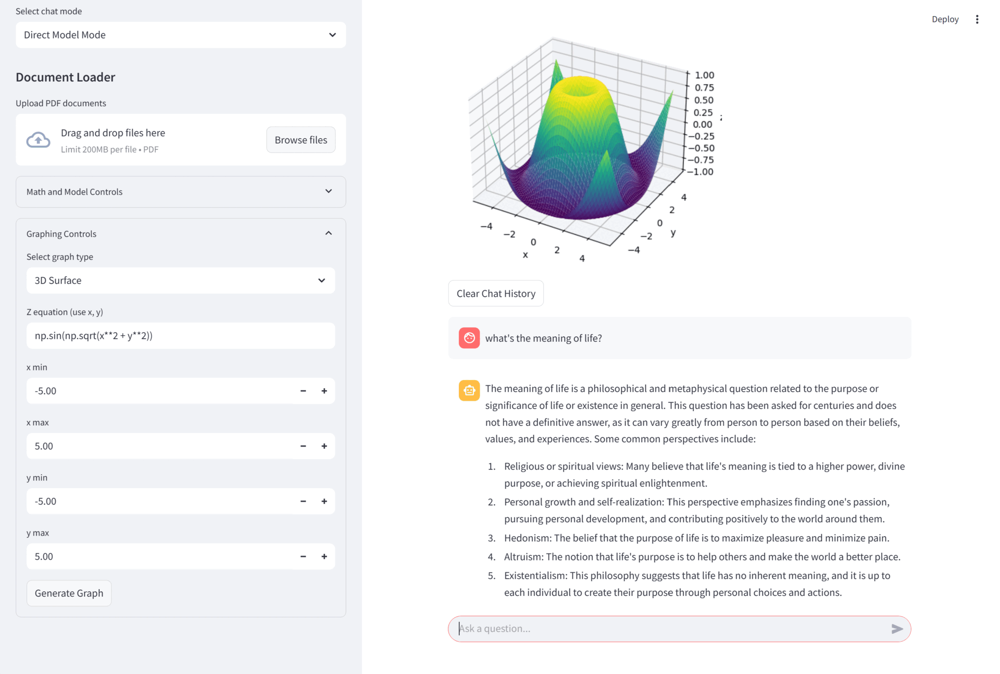

<a href='http://github.com/rkarikari/' target="_blank"> </a>


# RadioSport-chat


Run it using the app launcher(windows)

for (linux), using
```
streamlit run .\rag.py
```

# RadioSport-chat v2.5.4

 See Readme in RagChat_PDF folder for details.

# RadioSportChat

**RadioSportChat** is a standalone AI-powered chat application for interacting with documents using natural language processing. Built with Streamlit, it leverages Ollama for language model capabilities and Tesseract-OCR for text extraction from images and PDFs. 

## Features

- **Dual Chat Modes**:
  - **RAG Mode**: Answers queries using content from uploaded PDFs with fixed models (`granite3.3:2b` for LLM, `nomic-embed-text:latest` for embeddings).
  - **Direct Model Mode**: General-purpose chat with customizable Ollama models.
- **PDF Document Processing**:
  - Upload multiple PDFs for text extraction using `pdfplumber`.
  - File deduplication to prevent redundant processing.
  - Progress bar for document loading.
- **Graphing Capabilities**:
  - Supports 19 graph types: Parametric, Function, Polar, Scatter, 3D Surface, 3D Scatter, 3D Line, Contour, Bar, Column, Stacked Bar, Pie Chart, Histogram, Line Chart, Area Chart, Waterfall Chart, Radar Chart, Box Plot, Violin Plot, Error Bar.
  - Manual input or CSV file upload for data.
  - Customizable parameters (e.g., equations, ranges, bins).
- **LaTeX Rendering**:
  - Input and render mathematical expressions using MathJax.
  - Store and display multiple expressions.
- **Model Selection**:
  - Choose from available Ollama LLM and embedding models in Direct Model Mode.
  - Fixed models in RAG Mode for consistency.
- **Floating Reasoning Window**:
  - Displays `<think>...</think>` reasoning text in a separate, auto-scrolling window during streaming responses.
- **Performance Optimizations**:
  - Cached QA chain creation and model listing.
  - Suppressed unnecessary logging for a clean console.
  - Efficient PDF processing with deduplication.
- **User-Friendly Interface**: Streamlit-based web interface at `http://localhost:8501`.

## Installation

1. **Download the Installer**:
   - Download `RadioSportChat-2.0.5.msi` from [Releases](https://github.com/rkarikari/RadioSport-chat/releases).

2. **Run the Installer**:
   - Double-click `RadioSportChat-2.0.5.msi` and follow the instructions.

3. **Launch the Application**:
   - Find **RadioSportChat** in the Start Menu or desktop shortcut.
   - The app opens in your browser at `http://localhost:8501`.

## Prerequisites

- **Ollama**:
  - Install from [ollama.ai](https://ollama.ai/).
  - Start the server:
    ```bash
    ollama serve
    ```
  - Verify:
    ```bash
    ollama list
    ```

- **Python 3.11**:
  - Install python 3.11.
  - create a venv:
    ```bash
    mkdir c:\venv
    python -m venv c:\venv
    c:\venv\scripts\activate
    ```
  - Install required python packages:
    ```bash
    pip install -r requirements.txt
    ```
  - Include c:\venv in your path:


- **Web Browser**:
  - Requires a Chromium-based browser (e.g., Brave, Microsoft Edge, Google Chrome).

## Usage

1. **Start the Application**:
   - Launch RadioSportChat from the Start Menu or shortcut.

2. **Upload Documents**:
   - Upload PDFs or images via the Streamlit interface.

3. **Chat with Documents**:
   - Query document content using the chat interface.

4. **Visualize Data**:
   - Generate visualizations from document data.


   ```
